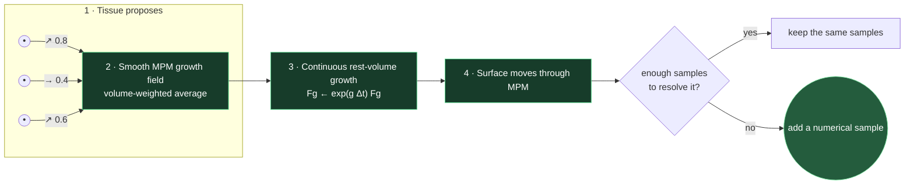
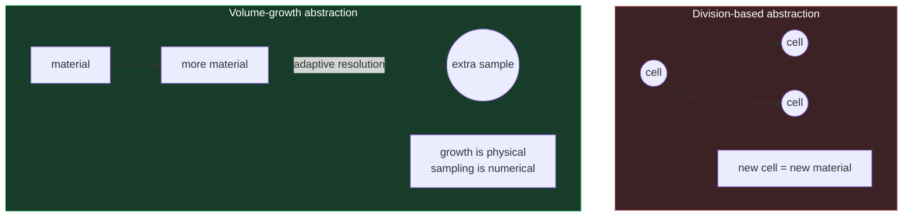

# Continuous tissue growth

The neural network emits only a local 2-D vector. Its magnitude is growth rate;
its direction shapes the growth tensor. Nearby vectors are smoothly integrated
on the same grid as MPM, so overlapping samples do not multiply growth. New
points conserve existing represented volume and are added only to restore
integration resolution.
