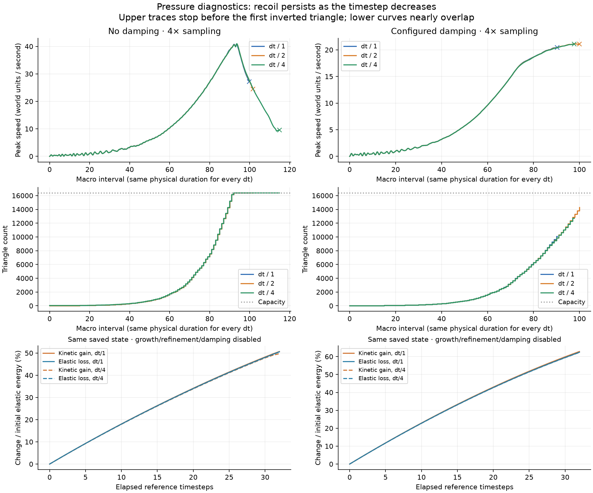

# Pressure-burst investigation

The tested release is predominantly elastic recoil, not a large numerical
energy injection. Smaller timesteps improve the energy balance but do not
remove the release. Triangle inversion is a separate geometry failure and can
occur before the sample limit. Production material settings remain unchanged.



## Evidence

The controlled experiment applies constant horizontal growth to a circular
seed, using E=10,000, nu=0.2, hardening=3, elasticity=0.5, fluidity=0,
compression inhibition at 0.1, and growth rate=120 per simulation second.
The grid is 128², reference dt=1/64,000 second, and a macro interval is 32
reference timesteps. Seed=17; seed-cell count=5×density; target spacing is
0.0027/sqrt(density); capacity=4,096×density. Mass and volume both scale
inversely with density. There are no neural actions, external forces, repulsion,
or material-area budget. This is a synthetic stress case, not a replay of the
user's unidentified run.

Full trajectories use dt, dt/2, and dt/4 with identical physical growth rates,
macro/refinement cadence, and measurement times. We tested both zero damping
and the configured damping loss 0.0393069564 per 16 reference timesteps.

At 4× density without damping, peak speed before inversion was **40.83, 40.89,
and 40.95**, respectively. A fourfold timestep reduction did not suppress it.
With configured damping, those peaks were **20.42, 21.14, and 21.07**; global
damping helps but does not eliminate the motion or geometry failure.

For a cleaner test, the state immediately preceding the largest measured
kinetic-energy increase before any inversion was saved. Exactly the same state
was replayed for 32 reference timesteps at dt, dt/2, dt/4, and dt/8, with growth,
refinement, external forces, and damping disabled. The material's existing
plasticity/hardening law remains active.

For the checkpoint from the damped 4× run:

| Replay timestep | Kinetic-energy gain, including APIC | Elastic-energy loss | Total-energy change |
|---|---:|---:|---:|
| dt | 12,189.14 | 12,107.06 | +0.0889% |
| dt/2 | 12,128.93 | 12,099.87 | +0.0315% |
| dt/4 | 12,092.31 | 12,094.85 | −0.00276% |
| dt/8 | 12,064.24 | 12,090.23 | −0.0282% |

Energies are in simulation units. Over 99% of the baseline kinetic gain is
matched by elastic loss; the release persists when the small positive energy
error disappears. This supports stored-energy release as the dominant mechanism
in this checkpoint. It is not evidence of an exact globally conservative solver:
plasticity, hardening, transfer, and finite precision still change energy.

Across all nine full trajectories, the largest instantaneous relative change in
the measured energy inventory at a refinement pass was below 4e-16. Splitting
copies F/G/C/velocity and partitions weights; it does not release stored stress.
Changing particle locations can still affect subsequent grid transfers.

The full growing runs are open energy/mass systems: growth creates material
and changes its rest state. Rising total energy while growth is active is not
by itself evidence of numerical energy creation.

## The apparent breaking event is distinct

Without damping, first inversion followed the sample limit. At 4×, inversion
occurred at t=0.04994, 0.05088, and 0.05750 seconds for dt, dt/2, and dt/4.

With configured damping, the baseline first inverted at t=0.0451875 seconds,
with **10,077 of 16,384 samples**, so exhaustion is not necessary. Its minimum
signed triangle area changed from +1.71e-10 to −1.28e-9 over four reference
steps. Peak speed changed only from **20.4207 to 20.4358** over that interval.
The first flip was not itself a sudden speed explosion.

This is an extremely thin triangle crossing through zero area under transport.
The current squared-edge-sum trigger measures spatial extent, not triangle
quality or transport error. Smaller timesteps changed the inversion time but
not monotonically in the damped runs. Comparing these nonlinear adaptive meshes
does not establish geometry convergence; remeshing decisions and float32
coordinate errors also vary.

The damped pre-inversion hardening multiplier stayed below 1.005. Although the
law permits roughly 3.3× hardening, that maximum is not the explanation for this
particular release. Some later undamped states do reach it.

## Next change supported by the measurements

Implement gradual, rate-dependent stress relaxation so the material permanently
deforms as stress accumulates, instead of storing as much recoverable energy.
Use a physical relaxation time, independent of timestep. Retain enough viscosity
to control the rate of deformation. Merely lowering dt or adding more triangles
does not address the measured recoil.

Separately investigate triangle-quality / transport-error refinement or remeshing.
Material relaxation should not be claimed to guarantee non-inverting geometry.
The subsequent global stress-relaxation experiment was removed at the user's
request because it reduced the desired elastic response during manipulation.
The previous elastic/plastic law is restored; these findings remain diagnostic
evidence, not a recommendation to re-enable global relaxation.

## Instrumentation and reproducibility

`trainer/pressure_diagnostics.py` measures the fixed-corotated elastic potential
and point plus affine APIC kinetic energy:

- Elastic: sum V*q*det(G) [mu*||Fe−R||² + lambda/2*(det(Fe)−1)²].
- Translational kinetic: sum 0.5*m*|v|².
- Affine kinetic: sum m*dx²/8*||C||², using APIC D=dx²/4 I.
- Signed domain area, triangle quality, inversion count, growth/mass, hardening,
  volumetric pressure, speed, edge length, and sample count.

`MpmCore(..., physics_dt=...)` now permits isolated timestep studies. Default dt
and the viewer are unchanged. Growth duration uses the caller's actual number
of substeps; damping is scaled to retain the same decay per physical second.
Per-substep fluidity and capped repulsion are disabled in these comparisons.

Run from `trainer/`:

```
.venv/bin/python pressure_diagnostics_check.py
.venv/bin/python pressure_burst_check.py --output /tmp/pressure-burst
.venv/bin/python pressure_burst_check.py --output /tmp/pressure-burst-damped --densities 4 --damping 0.039306956424563166
```

CSV traces and summary JSON are retained in
`trainer/experiments/pressure_burst/{undamped,damped}`. The experiment also writes
pre-burst NPZ states to its output directory for identical-state replay.
The diagnostic selection uses the largest sampled kinetic increase before
inversion, not an asserted physical fracture threshold.

Validation: energy inventory against the existing elastic reference; analytic
APIC energy and signed inversion checks; GPU equal-time growth, translation and
damping checks; default growth/conservation regression suite. All passed on Metal.
