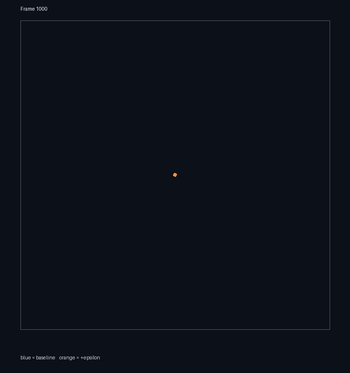

# Single-weight neural policy sensitivity at 1,000 frames

## Result

The two runs began from the same random brain and identical simulation state. Exactly one of 9,504 float32 parameters changed. At frame 1,000, the spatial output remained bit-for-bit identical; 7 saved internal-state values differed. The raw spatial output had a symmetric Chamfer distance of **0** domain units, RMS same-slot displacement was **0**, and particle counts were **5 vs 5**.

Blue is the baseline output; orange is the one-weight-perturbed output.

## Controlled change

- Random policy seed: `20260903`
- Rollout seed: `1701`
- Architecture: `stateful-128` (128 hidden units, 9 chemical channels)
- Changed parameter: flat index `7386`, `fc2.weight[divisionDrive, hidden 90]`
- Baseline value: `-0.0277223587`
- Perturbed value: `-0.02762235887`
- Requested delta: `0.0001`; actual float32 delta: `9.999983013e-05`
- Verification: `1` changed parameter out of `9504`
- One frame: 4 neural updates + 16 physics substeps

## Difference over time

| Frame | Baseline n | Perturbed n | Chamfer | Paired RMS | Paired max | Changed saved values | Max state delta |
|---:|---:|---:|---:|---:|---:|---:|---:|
| 0 | 5 | 5 | 0 | 0 | 0 | 0 | 0 |
| 1 | 5 | 5 | 0 | 0 | 0 | 5 | 4.5653433e-06 |
| 10 | 5 | 5 | 0 | 0 | 0 | 5 | 7.8920275e-06 |
| 50 | 5 | 5 | 0 | 0 | 0 | 5 | 3.6247075e-06 |
| 100 | 5 | 5 | 0 | 0 | 0 | 6 | 3.4682453e-06 |
| 250 | 5 | 5 | 0 | 0 | 0 | 7 | 1.2844801e-05 |
| 500 | 5 | 5 | 0 | 0 | 0 | 7 | 1.4975667e-05 |
| 750 | 5 | 5 | 0 | 0 | 0 | 7 | 1.6644597e-05 |
| 1000 | 5 | 5 | 0 | 0 | 0 | 7 | 9.9688768e-06 |

Chamfer is the symmetric nearest-neighbor distance between raw output point clouds. Paired values compare particles by stable slot index for the shared prefix. "Saved values" covers positions, velocities, deformation, affine state, tensor-growth/rest state, heading, angular velocity, color, division hazard/threshold/propensity, recurrent private state, and per-agent chemical state. Coordinates use the simulation's unit-square domain.

## Output files

- `baseline_weights.npy`, `perturbed_weights.npy`: complete policies
- `baseline_states.npz`, `perturbed_states.npz`: positions, velocities, deformation, affine state, and growth/rest state at every reported checkpoint
- `metrics.csv`, `report.json`: machine-readable results
- `comparison_frame_0100.png`, `comparison_frame_0500.png`, `comparison_frame_1000.png`: visual overlays

## Interpretation

This random brain never initiated growth: both runs stayed at five particles. The changed weight feeds the division-drive output, and the perturbation produced small float32 differences in `agent_mitosis_propensity` and accumulated `agent_division_hazard` (maximum saved delta `9.9688768e-06` at frame 1,000). Those differences never crossed a stochastic division threshold. Because the current shared defaults also set translational acceleration controls to zero, there was no alternate motion pathway through which this particular weight could affect position. The observed effect for this controlled pair is therefore **measurable inside the division controller, but zero in the spatial/physical output**.

This is a deterministic paired sensitivity test for one randomly initialized policy, not a population-level estimate. A single zero-effect run does not show that every weight is insensitive. Estimating typical sensitivity would require repeating the pair across weights, policy seeds, and rollout seeds.
